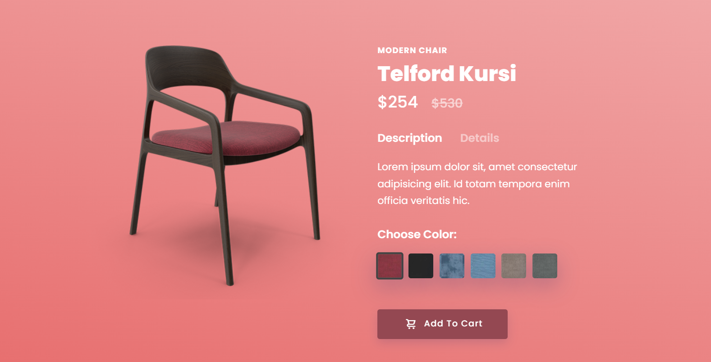
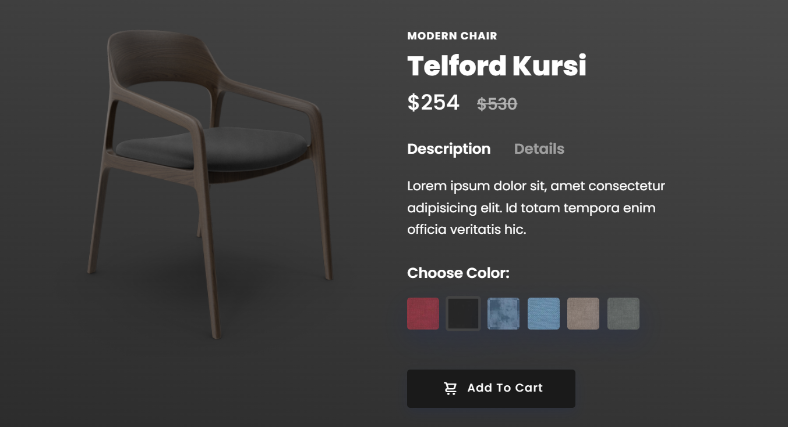
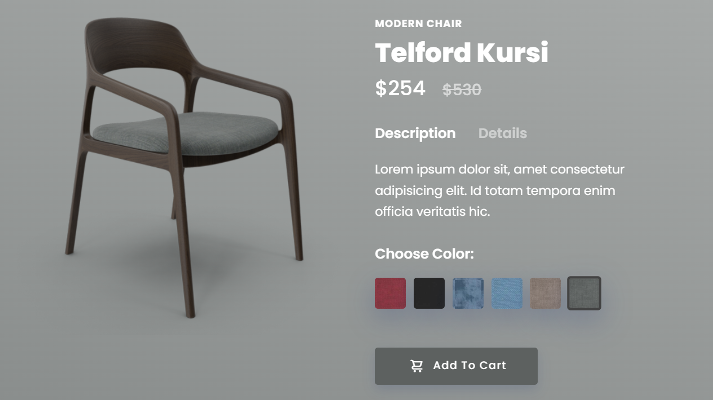

# Modern Chair Page

A sleek and modern product page showcasing the Telford Kursi chair. This page includes features such as a description and details section, color selection, and an option to add the chair to a shopping cart.






## Features

- **Description and Details Toggle**: Switch between viewing the product description and details.
- **Color Selection**: Choose from a variety of colors for the chair.
- **Add to Cart**: Simple button to add the chair to the shopping cart.
- **Responsive Design**: Ensures a seamless viewing experience on various devices.

## Demo

Check out the live demo: [Demo Link](https://mkraj-7838.github.io/Modern-Chair-Page/)

## Installation

To get a local copy up and running, follow these simple steps:

1. **Clone the repo**
    ```sh
    git clone https://github.com/your-username/Modern-Chair-Page.git
    ```

2. **Navigate to the project directory**
    ```sh
    cd Modern-Chair-Page
    ```

3. **Open `index.html` in your browser**

## Usage

1. Open the `index.html` file in your preferred web browser.
2. View the product description and details by toggling between the options.
3. Select a color for the chair using the color options.
4. Click the "Add To Cart" button to add the chair to the shopping cart.
